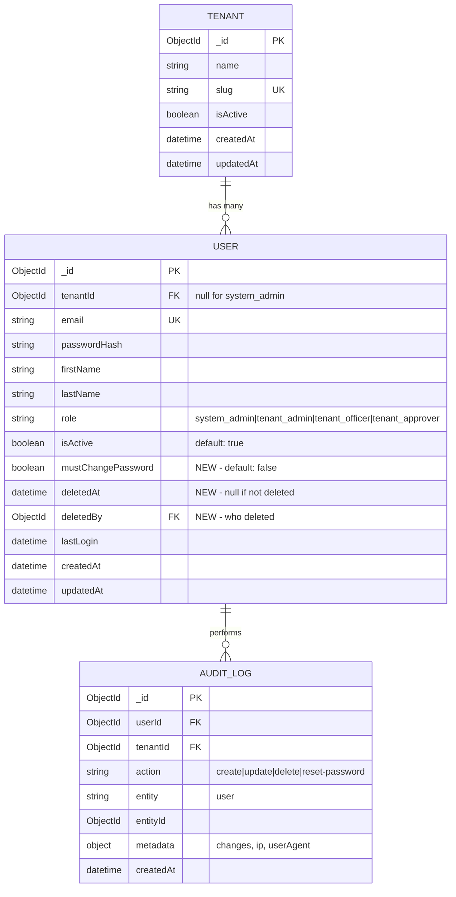

# feat: Tenant Admin User Management

## Overview

Enable system administrators to manage tenant administrators through a dedicated page at `/system/tenants/[id]/users`. This establishes the proper management hierarchy: **System Admin → Tenant Admin → Officers/Approvers**, where each level manages the level below.

**Key Capabilities:**
- Full CRUD operations on tenant admins within any tenant
- Temporary password generation with forced change on first login
- Soft delete (deactivation) with audit trail preservation
- Complete audit logging for compliance

## Problem Statement / Motivation

Currently, system admins can view tenant admins when viewing tenant details, but cannot:
- Create new tenant admins for a tenant
- Edit tenant admin profiles
- Reset tenant admin passwords
- Deactivate/remove tenant admins

This blocks tenant onboarding workflows and forces manual database operations for user management.

## Proposed Solution

### UI: New Page at `/system/tenants/[id]/users`

**Page Structure:**
```
┌─────────────────────────────────────────────────────────────┐
│ Breadcrumb: System / Tenants / {Tenant Name} / Admins       │
├─────────────────────────────────────────────────────────────┤
│ Page Header: "Tenant Administrators"      [+ Add Admin]     │
├─────────────────────────────────────────────────────────────┤
│ Search: [Search by name or email...]  Filter: [All ▼]       │
├─────────────────────────────────────────────────────────────┤
│ ┌─────────────────────────────────────────────────────────┐ │
│ │ Name          │ Email           │ Status │ Created │ ⋮  │ │
│ │ Alice Smith   │ alice@acme.com  │ Active │ Mar 15  │ ⋮  │ │
│ │ Bob Johnson   │ bob@acme.com    │ Active │ Mar 10  │ ⋮  │ │
│ └─────────────────────────────────────────────────────────┘ │
│                     [Page 1 of 3]                            │
└─────────────────────────────────────────────────────────────┘
```

**Row Actions Menu (⋮):**
- Edit Profile
- Reset Password
- Deactivate / Activate
- Delete (soft delete)

### API Endpoints

| Method | Endpoint | Description |
|--------|----------|-------------|
| GET | `/api/system/tenants/[id]/users` | List tenant admins for tenant |
| POST | `/api/system/tenants/[id]/users` | Create new tenant admin |
| PATCH | `/api/system/tenants/[id]/users/[userId]` | Update tenant admin |
| DELETE | `/api/system/tenants/[id]/users/[userId]` | Soft delete tenant admin |
| POST | `/api/system/tenants/[id]/users/[userId]/reset-password` | Reset password |

### Pinia Store Actions

Add to `stores/system.ts`:
```typescript
// Tenant admin management actions
fetchTenantAdmins(tenantId: string): Promise<TenantUser[]>
createTenantAdmin(tenantId: string, data: CreateTenantAdminDto): Promise<TenantUser>
updateTenantAdmin(tenantId: string, userId: string, data: UpdateTenantAdminDto): Promise<TenantUser>
deleteTenantAdmin(tenantId: string, userId: string): Promise<void>
resetTenantAdminPassword(tenantId: string, userId: string): Promise<{ tempPassword: string }>
```

## Technical Considerations

### Architecture

**Follows established patterns from:**
- `server/api/tenant/users/` - CRUD endpoint structure
- `stores/users.ts` - Pinia store action patterns
- `pages/system/tenants/[id].vue` - Page layout and data loading

**Key Pattern Differences:**
- System admin routes use `requireSystemAdmin()` not `requireTenantAdmin()`
- Tenant ID comes from URL parameter, not user context
- Only manages `tenant_admin` role (not officers/approvers)

### User Model Changes

Add field to support forced password change:

```typescript
// server/models/User.ts
mustChangePassword: {
  type: Boolean,
  default: false
}
```

### Security Considerations

| Concern | Mitigation |
|---------|------------|
| Cross-tenant access | Validate tenant ID from URL, ensure target user belongs to that tenant |
| Role escalation | Only allow creating/managing `tenant_admin` role |
| Session persistence after delete | Invalidate refresh tokens on soft delete |
| Password logging | Never log temporary passwords in audit trail |
| CSRF | All state-changing endpoints validate CSRF token |
| Rate limiting | Limit password reset to 3 per admin per hour |

### Performance Implications

- Server-side pagination (20 items default)
- Indexed query: `{ tenantId, role: 'tenant_admin', deletedAt: null }`
- Single database round-trip per action

### Soft Delete Implementation

```typescript
// User model additions
deletedAt: { type: Date, default: null }
deletedBy: { type: Types.ObjectId, ref: 'User', default: null }

// Query pattern for list
User.find({
  tenantId,
  role: 'tenant_admin',
  deletedAt: null  // Exclude soft-deleted
})
```

## Acceptance Criteria

### Functional Requirements

- [x] **Navigation:** System admin can navigate from tenant detail page to users page via "Manage Admins" button
- [x] **Breadcrumbs:** Page shows breadcrumb: System / Tenants / {Tenant Name} / Admins
- [x] **List View:** Display tenant admins with columns: Name, Email, Status, Created Date, Last Login, Actions
- [x] **Empty State:** Show appropriate message and CTA when tenant has no admins
- [x] **Create Admin:** Form collects firstName, lastName, email; generates temp password
- [x] **Temp Password Display:** Show generated password in modal with copy button after creation
- [x] **Force Password Change:** New users must change password on first login (`mustChangePassword: true`)
- [x] **Edit Admin:** Can update firstName, lastName, email (with re-verification), isActive status
- [x] **Soft Delete:** Sets `deletedAt` timestamp, invalidates user sessions, excluded from queries
- [x] **Last Admin Protection:** Cannot delete if user is the only active tenant admin
- [x] **Reset Password:** Generates new temp password, invalidates sessions, sets `mustChangePassword: true`
- [x] **Audit Logging:** All CRUD operations logged with actor, action, target, timestamp, IP

### Non-Functional Requirements

- [x] **Loading States:** Skeleton loaders for table, spinners for action buttons
- [x] **Error Handling:** User-friendly error messages for all failure scenarios
- [x] **Responsive:** Table adapts to mobile (card view or horizontal scroll)
- [ ] **Pagination:** Server-side, 20 items per page
- [x] **Search:** Client-side filter by name or email
- [x] **Theme Compliance:** Follows Vuetify customization guidelines (Sora headings, Plus Jakarta body)

## Success Metrics

| Metric | Target |
|--------|--------|
| Page load time | < 500ms with 20 users |
| Create user flow | < 3 clicks to complete |
| Audit coverage | 100% of state-changing actions logged |
| Error recovery | All errors have clear recovery path |

## Dependencies & Risks

### Dependencies

- Existing `User` model (needs `mustChangePassword`, `deletedAt`, `deletedBy` fields)
- Existing `stores/system.ts` (extend with new actions)
- Existing audit logging utility (`server/utils/audit.ts`)
- SMTP configuration for email notifications (already configured)

### Risks

| Risk | Likelihood | Impact | Mitigation |
|------|------------|--------|------------|
| Email delivery failures | Medium | Medium | Show temp password in UI, fallback to manual reset |
| Concurrent edit conflicts | Low | Low | Last-write-wins, no optimistic locking for MVP |
| Session invalidation complexity | Medium | High | Leverage existing refresh token revocation pattern |

## References & Research

### Internal References

- User model schema: `server/models/User.ts:20-81`
- Existing tenant user CRUD: `server/api/tenant/users/`
- System store patterns: `stores/system.ts`
- Tenant detail page: `pages/system/tenants/[id].vue`
- Role guards: `server/utils/requireRole.ts:18-47`
- Password utilities: `server/utils/password.ts`
- Audit logging: `server/utils/audit.ts:19-60`

### Related Work

- Brainstorm document: `docs/brainstorms/2026-03-27-tenant-admin-management-brainstorm.md`
- Implementation status: `docs/IMPLEMENTATION_STATUS.md`
- Vuetify guidelines: `docs/VUETIFY_CUSTOMIZATION.md`

---

## Implementation Checklist

### Phase 1: Backend (API + Model)

**Model Updates:**
- [x] `server/models/User.ts` - Add `mustChangePassword`, `deletedAt`, `deletedBy` fields
- [x] Add compound index: `{ tenantId: 1, role: 1, deletedAt: 1 }`

**API Endpoints:**
- [x] `server/api/system/tenants/[id]/users/index.get.ts` - List tenant admins
- [x] `server/api/system/tenants/[id]/users/index.post.ts` - Create tenant admin
- [x] `server/api/system/tenants/[id]/users/[userId].patch.ts` - Update tenant admin
- [x] `server/api/system/tenants/[id]/users/[userId].delete.ts` - Soft delete
- [x] `server/api/system/tenants/[id]/users/[userId]/reset-password.post.ts` - Reset password

**Utilities:**
- [x] `server/utils/password.ts` - Add `generateTemporaryPassword()` function
- [x] `server/utils/session.ts` - Add `invalidateUserSessions(userId)` function

### Phase 2: Store + Composables

**Store Updates:**
- [x] `stores/system.ts` - Add tenant admin state and actions
- [ ] `composables/useTenantAdmins.ts` - Optional composable for page logic (skipped - logic in page component)

### Phase 3: UI Components

**Page:**
- [x] `pages/system/tenants/[id]/users.vue` - Main users page

**Dialogs:**
- [x] Create Admin Modal - Form with firstName, lastName, email
- [x] Edit Admin Modal - Pre-filled form with current data
- [x] Delete Confirmation Dialog - Warning with user name
- [x] Password Reset Confirmation - Shows new temp password with copy button

### Phase 4: Integration

**Navigation:**
- [x] Update `pages/system/tenants/[id].vue` - Add "Manage Admins" link in Quick Actions

**Auth Middleware:**
- [ ] Update login flow to check `mustChangePassword` and redirect (deferred - separate feature)

**Audit Integration:**
- [x] Add audit logging to all new endpoints

---

## ERD: User Model Changes


